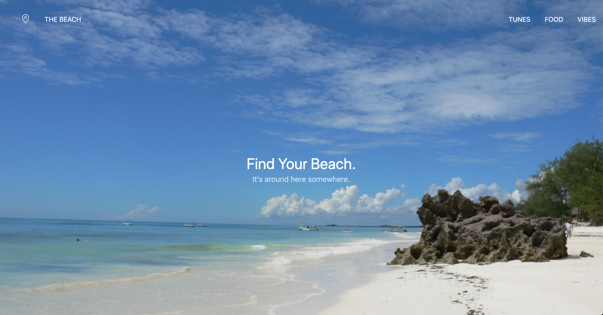

# Find Your Beach

### What we're building
- We're going to be creating a landing page to "Find Your Beach". The final product should look like this: 


- There's also a slideshow, so there will be 2 other images that you can scroll through on the main page. 

### The Slideshow
1. First, let's add the slideshow to our page. Navigate [here](https://getuikit.com/docs/slideshow#usage) to see an example of the slideshow in action and to copy/paste the code under the Markup tab into our index.html inside the ```body``` tags (make sure you fix the spacing). 

1. Add the slideshow to our page using the 3 images we've provided inside the images folder (beach1.jpg, beach2.jpg, beach3.jpg). Hint: You'll need to use a relative path similar to the slideshow example. 

1. In the terminal, run ```open index.html``` and let's see if our slideshow is working! 

1. Let's add an overlay of text over each of our images. Navigate to this [link](https://getuikit.com/docs/slideshow#content-overlays) and click on the Markup tab to see the code. You should see a ```div``` under each ```img``` tag that is an overlay. See if you can add a centered overlay to your page, and replace the text with your own words. 


### The Navbar

1. Now let's add a navbar to our page! If you look back at the image of our final product, you'll notice that we have a transparent navbar at the top. Follow this [link](https://getuikit.com/docs/navbar#transparent-modifier) to see if you can add a transparent navbar with the elements floating to the right (Tunes, Food, Vibes). Note, your navbar code should go above your slideshow code in our index.html file. 

**Having trouble?** You will need to add the class ```uk-position-z-index``` to the outermost div in the navbar for it to be placed on top of your images and visible. This class sets the z-index to 1. [Here's](https://developer.mozilla.org/en-US/docs/Web/CSS/z-index) a tool you can use to understand z-indices a little better. Elements with a higher z-index sit on top of elements with a lower z-index. 

1. Refresh the page and make sure your navbar is working. If so, let's add the elements to the left side of our navbar. You'll see in the picture that we have an icon and another element titled, "The Beach". To add an icon, use the code ```<span uk-icon="heart"></span>``` and pick the icon you'd like from this [list](https://getuikit.com/docs/icon#library).

1. Now let's split up our navbar into the right and left sections. [Here](https://getuikit.com/docs/navbar#multiple-navigations) is the documentation that explains how to do that.

1. Add some links into your navigation that bring the user to other webpages. *Hint* you'll do this by adding a link to the href of each `<a>` tag in your navigation.


### Extension
1. Part of being a developer is learning to read through documentation to implement code created by others. Read through more possible features in the slideshow and/or navbar documentation to add some new effects. To give you some ideas: 
      - Slideshow has animation, finite scrolling, content parallax...
      - Navbar has dropdowns, dropbars, options to delay show, as well as events on beforeshow or shown.
1. Pick some other components from the documentation to add to your site. Some fun ones might be: accordion, animation, article, comment, card, lightbox, grid. The world is your oyster! Play around with the possibilities.


